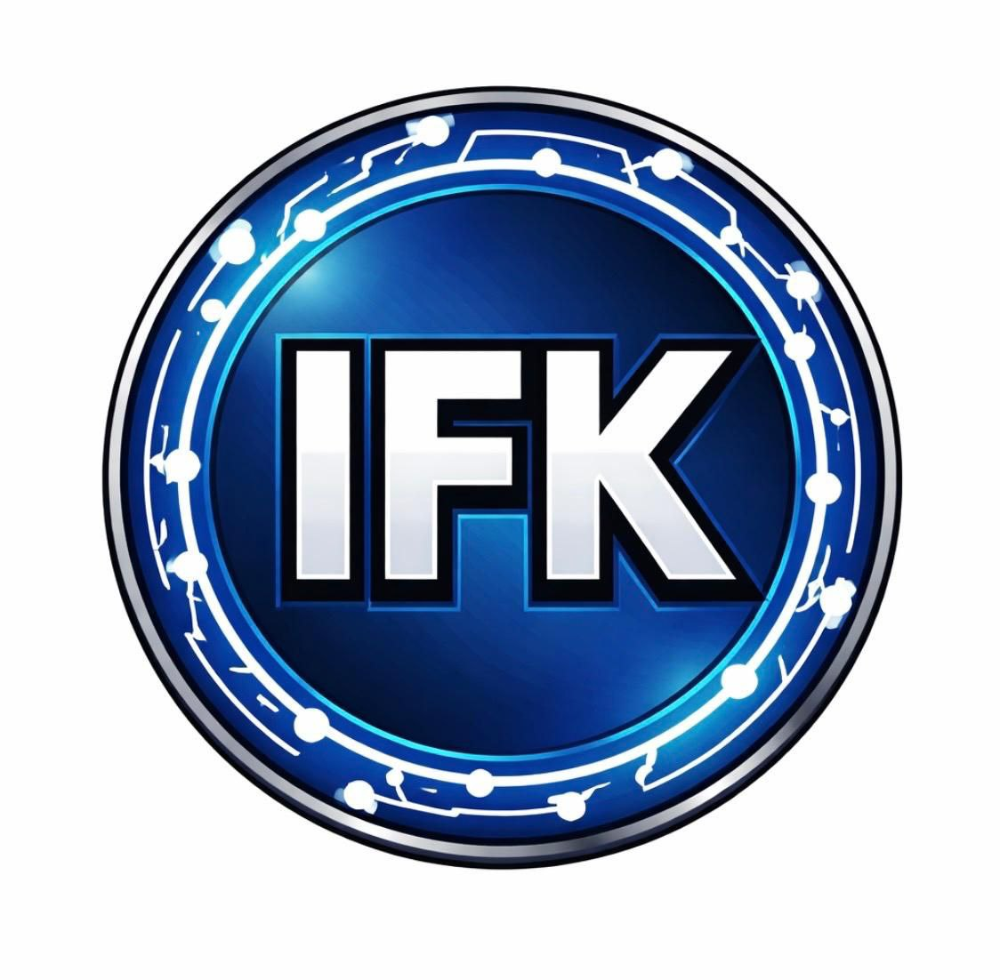

  

<h1 align="center">Token Inflation Killer (IFK)</h1>

  <strong>ERC-20 Token on Base Blockchain</strong>

  
  
  
  

---

## 🔹 Token Details
| Parameter          | Value |
|-------------------|-------|
| **Name**          | Token Inflation Killer |
| **Symbol**        | IFK |
| **Network**       | Base |
| **Contract Address** | 0xBc78d490737ff2395e2674C7E40E6689099Cc942 |
| **Total Supply**  | 1,000,000 IFK |

---

## 🔹 Purpose
IFK is a community-driven token that promotes **transparency** and **fair tokenomics** within decentralized ecosystems.  
It is designed for safe, fair, and community-focused growth.

---

## 🔹 Official Links
- [View Token on BaseScan](https://basescan.org/token/0xBc78d490737ff2395e2674C7E40E6689099Cc942)  
- [Visit Project Website](https://jahan2211.github.io/ifk-token)

---

## 🔹 How to Add / Buy IFK
To add IFK to your wallet (MetaMask / Web3 wallet):

1. Open your wallet and select **“Add Token”**.  
2. Choose **Custom Token**.  
3. Enter the following:
   - **Token Contract Address:** `0xBc78d490737ff2395e2674C7E40E6689099Cc942`  
   - **Token Symbol:** `IFK`  
   - **Decimals:** `18`  
4. Confirm → Token will appear in your wallet.  

  

---

  <em>Developed by IFK Team</em>

